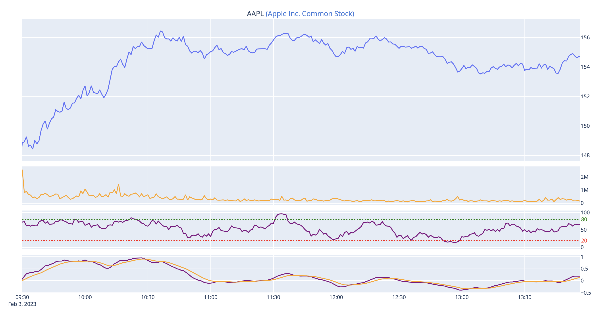

# About the Project

Stock Market Research Tool for analyzing stock prices using historic data with indicators such as Volume, RSI and MACD. 
Leveraged Alphavantage for downloading historic stock data for 1-min chart and leveraged yfinance for downloading daily stock data.

